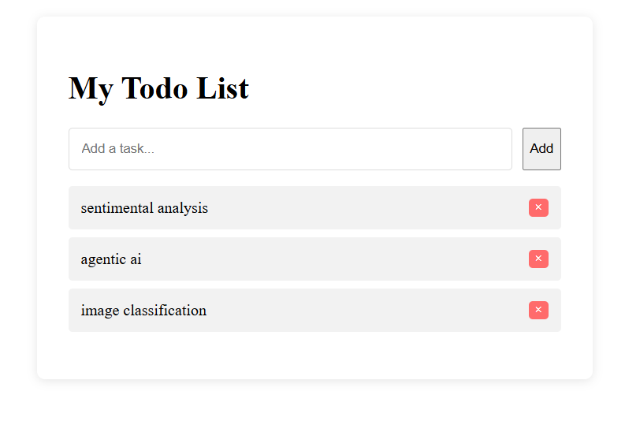

# ✅ Todo List Website

A simple browser-based task manager built with HTML, CSS, and JavaScript.

## 🌐 How to Use This Website

1. **Open the website**  
   - Download the project files
   - Open `index.html` in any modern browser (Chrome, Firefox, Edge)

2. **Manage your tasks**  
   - Type a task and click "Add"  
   - Click the ❌ button to delete tasks  
   - Tasks are saved automatically in your browser

## 💻 Technical Details
- **Type**: Static website (no backend required)
- **Storage**: Uses `localStorage` to save tasks
- **Compatibility**: Works on all modern browsers
- **Dependencies**: None (100% vanilla JavaScript)