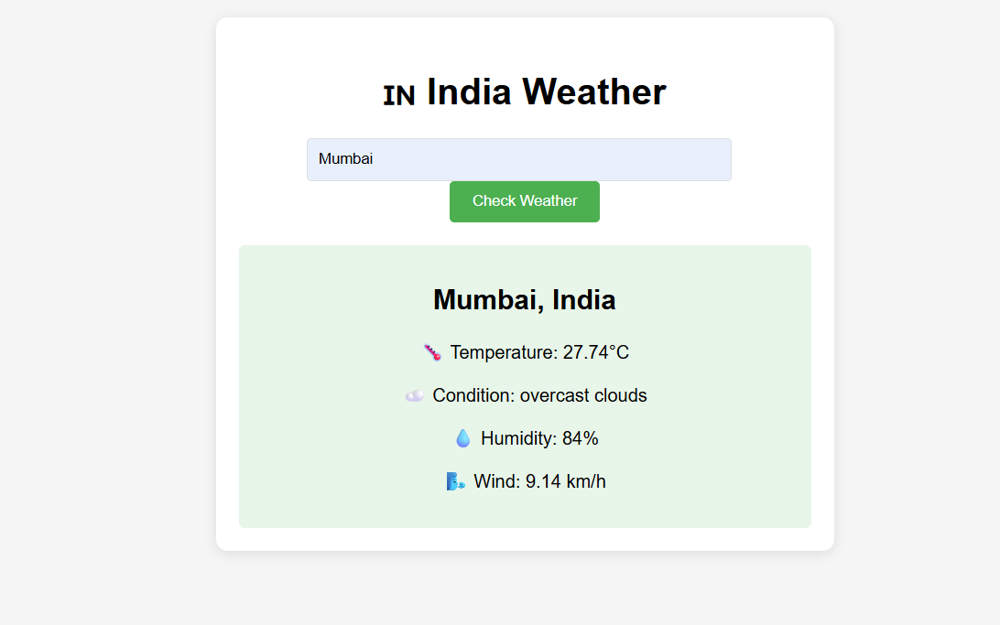

# 🌦️ India Weather Checker

A simple site to check real-time weather conditions for Indian cities using OpenWeatherMap API.

## 🌐 How to Use This Website

1. **Get a free API key**  
   - Sign up at [OpenWeatherMap](https://home.openweathermap.org/users/sign_up)
   - Copy your key from [API Keys page](https://home.openweathermap.org/api_keys)

2. **Open the website**  
   - Download the project files
   - Open `index.html` in any web browser

3. **Start checking weather**  
   - Paste your API key that prompted
   - Enter any Indian city (e.g., "Delhi", "Mumbai", "Bangalore")

## 💻 Technical Details
- **Type**: Static website (HTML/CSS/JavaScript)
- **Data Source**: [OpenWeatherMap API](https://openweathermap.org/api)
- **Compatibility**: Works on all modern browsers

## 🔒 Privacy Note
- Your API key is used only in your browser
- No data is stored or sent to any other server